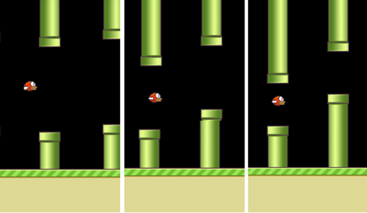
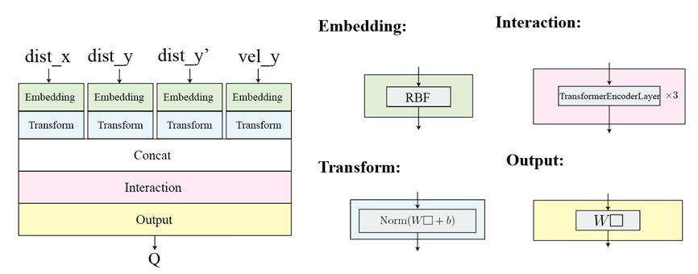
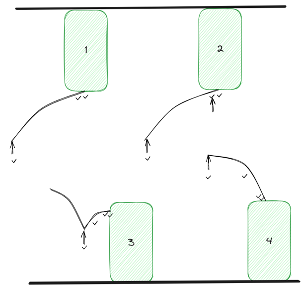
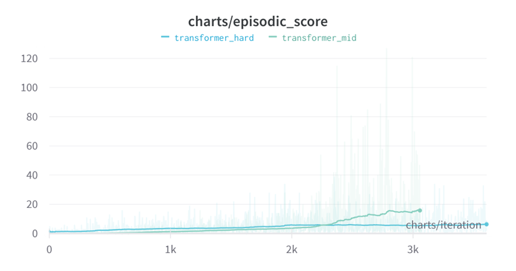

# doubleDQN for Flappy-bird env

> HUST CS Reinforcement Learning 2023 Fall (Master course)

## Environment
The environment is flappy-bird, which is a famous game. You need to keep the bird alive by touching the screen in proper time. Otherwise the bird hit ground or the pipe, game is over.

The game can be divided into three levels of difficulty by the gap size between upper pipe and lower pipe. On easy difficulty, the gap size is 200, middle is 150, hard is 100.

Fig 1. Different difficulty in game (left to right: easy, middle, hard)

## Improvement
1. From DQN to doubleDQN

    a. training in DQN:
    $y_j=r_j+\gamma\max_{a'} \hat Q(\phi_{j+1},a',\theta^-)$

    $v_j=Q(\phi_{j+1},a_j,\theta)$

    $loss=avg(\Vert v-y\Vert^2)$

    b. training in doubleDQN:
    $y_j=r_j+\gamma\hat Q(\phi_{j+1},argmax_{ a'}Q(\phi_{j+1}, a',\theta),\theta^-)$

    $v_j=Q(\phi_{j+1},a_j,\theta)$

    $loss=avg(\Vert v-y\Vert^2)$

2. Modified state space

    Use distance (x&y) to the next pipe and y_velocity.

    Also add bird's distance to next next pipe when the bird is in the pipe. (Borrow the idea from this [blog](https://towardsdatascience.com/use-reinforcement-learning-to-train-a-flappy-bird-never-to-die-35b9625aaecc))

    So the final state space is dist_x (to next pipe), dist_y (to next pipe), y_vel , dist_y' (to next next pipe when bird is in the pipe).

3. Model design
Use Gaussian RBF kernel to embed the scalar feature to vector. And use transformerEncoder layer to interact between data.

Fig 2. Model architecture

4. Post-process reward on episode
Will post-process the reward on the episode according to the cause of death. When the bird fly too high, algorithm will give penalty to the last flap frame. Similarly, when the bird fly too low, algorithm will give penalty to the last flap frame and random frame between death frame and the last flap frame. And under all situation, give penalty to last two frame before death. (The penalty for upper pipe is borrowed from this [blog](https://towardsdatascience.com/use-reinforcement-learning-to-train-a-flappy-bird-never-to-die-35b9625aaecc) too, while the penalty for lower pipe is my own idea)

Fig 3. Post-process algorithm (Arrow symbol is the flap frame, while checkmark is the frame to give penalty)

## Result

Fig 4. Train result under middle and hard difficulty. (Get one score when the bird pass one pipe)

## Reference
- [FlapAI Bird: Training an Agent to Play Flappy Bird Using Reinforcement Learning Techniques (arxiv)](https://arxiv.org/pdf/2003.09579.pdf)
- [Deep Reinforcement Learning for Flappy Bird (arxiv)](https://cs229.stanford.edu/proj2015/362_report.pdf)
- Hasselt, H.V., Guez, A., & Silver, D. (2015). Deep Reinforcement Learning with Double Q-Learning. AAAI Conference on Artificial Intelligence.
- [Using Deep Q-Network to Learn How To Play Flappy Bird](https://github.com/yenchenlin/DeepLearningFlappyBird/tree/master)
- [Use reinforcement learning to train a flappy bird which NEVER dies](https://github.com/kyokin78/rl-flappybird/tree/master)
- [CleanRL](https://docs.cleanrl.dev/rl-algorithms/dqn/#dqnpy)

